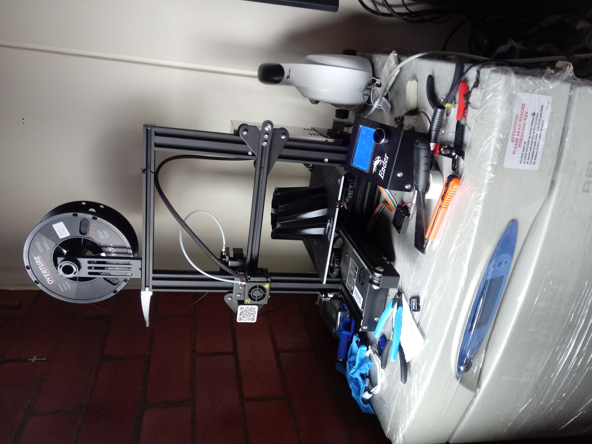
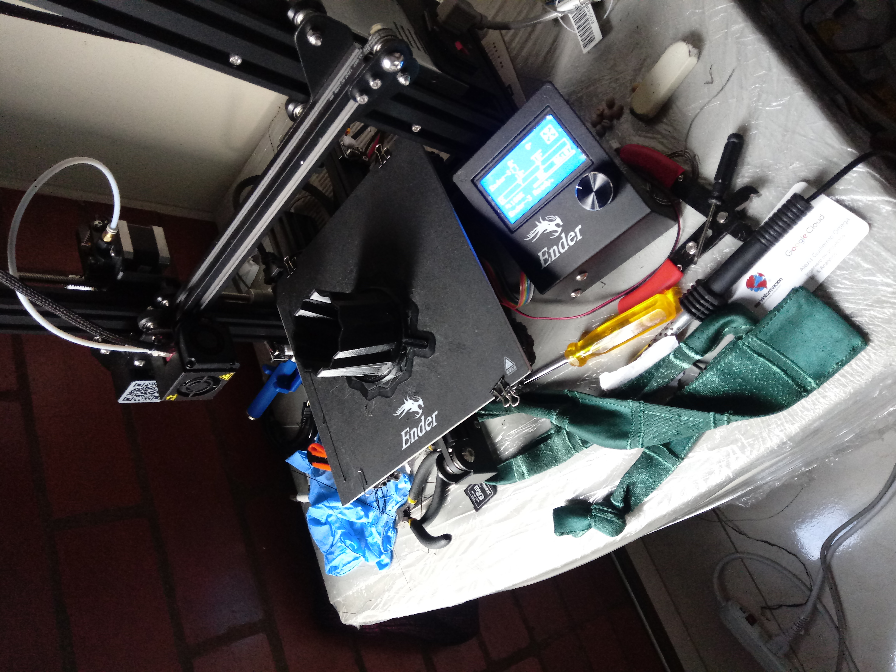
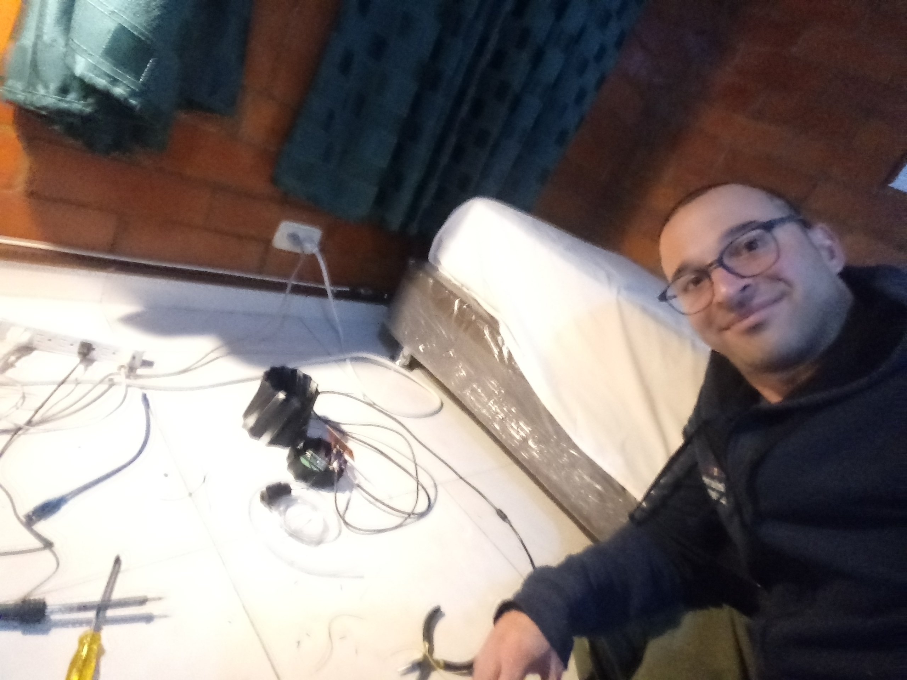
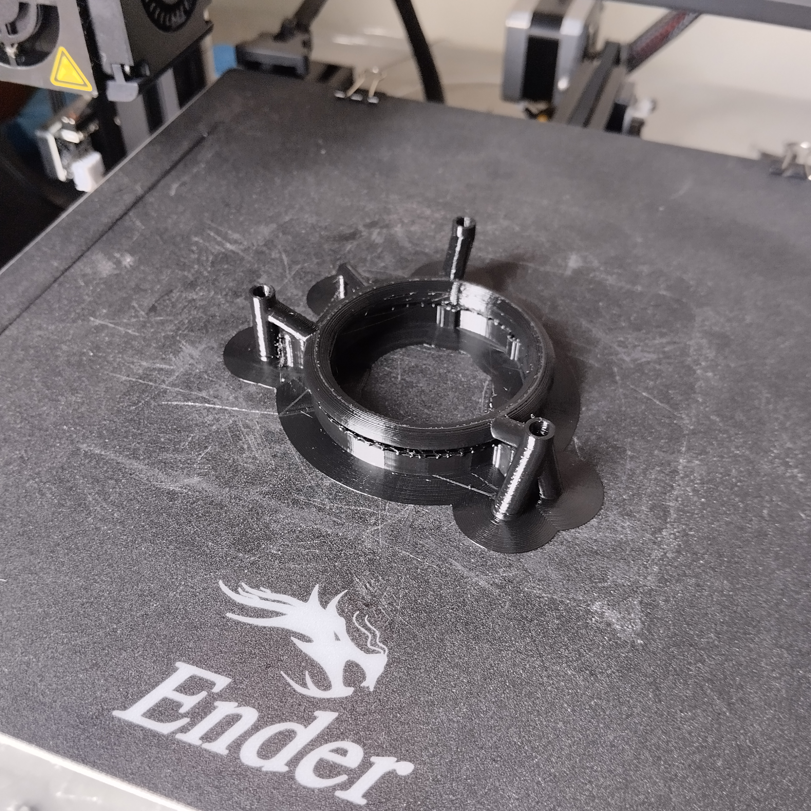
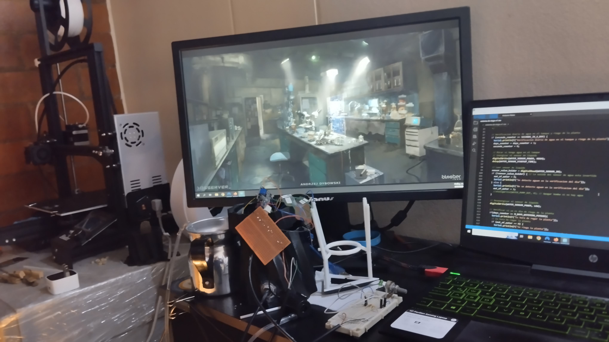
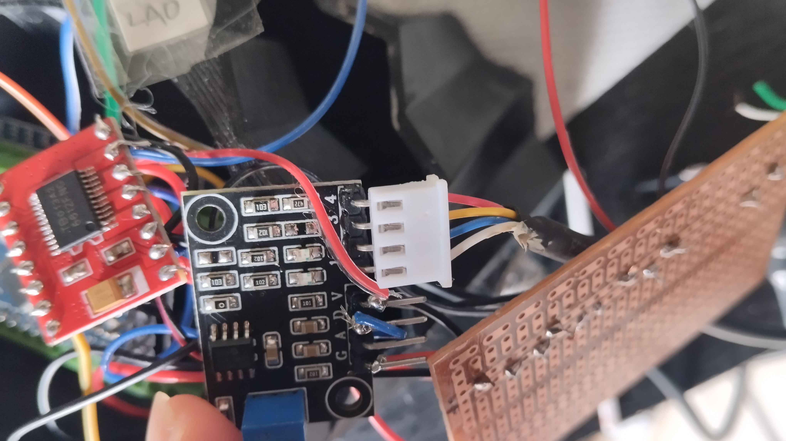

# Sistema de riego para planta decorativa

Este es un sistema de riego de una planta decorativa que posee su tanque y bomba de agua, sensor de luz, luces y sensor de líquido en el tanque, controlado por un Arduino Nano, el código está en el archivo [sistema-de-riego-v1.ino](./sistema-de-riego-v1.ino)

## Agradecimiento

Es un regalo para Jeni en agradecimiento por las cosas vividas...

## Imágenes y videos del proyecto

Aquí se presentan algunas imágenes y videos del proyecto:

### Tanque original de agua recien impreso

### Matera recien impresa

### Yo armando el sistema electrónico 

### Prueba de la tuberia de riego

### Mi escritorio con el proyecto casi terminado

### Random closed-up de la electrónica

### Imprimiendo una parte de una pieza para pruebas
[Pieza de prueba](https://photos.app.goo.gl/bVJ7gAGXdVgRhoGr6)

### Cuando construía el modelo 3D en la computadora (1)
")

### Cuando construía el modelo 3D en la computadora (2)
")